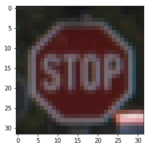
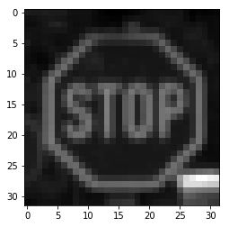

#**Traffic Sign Recognition** 

**Build a Traffic Sign Recognition Project**

The goals / steps of this project are the following:
* Load the data set (see below for links to the project data set)
* Explore, summarize and visualize the data set
* Design, train and test a model architecture
* Use the model to make predictions on new images
* Analyze the softmax probabilities of the new images
* Summarize the results with a written report

[//]: # (Image References)

![image1]: ./examples/visualization.jpg "Visualization"
![image2]: ./examples/grayscale.jpg "Grayscaling"
![image3]: ./examples/random_noise.jpg "Random Noise"
![image4]: ./traffic-signs-data/no_entry.jpg "Traffic Sign 1"
![image5]: ./traffic-signs-data/construction.jpg "Traffic Sign 2"
![image6]: ./traffic-signs-data/stop.png "Traffic Sign 3"
![image7]: ./traffic-signs-data/vorfahrt1.jpg "Traffic Sign 4"
![image8]: ./traffic-signs-data/vorfahrt2.jpg "Traffic Sign 5"

## Rubric Points
###Here I will consider the [rubric points](https://review.udacity.com/#!/rubrics/481/view) individually and describe how I addressed each point in my implementation.  

---
###Writeup / README

####1. Provide a Writeup / README that includes all the rubric points and how you addressed each one. You can submit your writeup as markdown or pdf. You can use this template as a guide for writing the report. The submission includes the project code.

You're reading it! and here is a link to my [project code](https://github.com/udacity/CarND-Traffic-Sign-Classifier-Project/blob/master/Traffic_Sign_Classifier.ipynb)

###Data Set Summary & Exploration

####1. Provide a basic summary of the data set. In the code, the analysis should be done using python, numpy and/or pandas methods rather than hardcoding results manually.

I used the pandas library to calculate summary statistics of the traffic
signs data set:

* The size of training set is 34799
* The size of the validation set is 4410
* The size of test set is 12630
* The shape of a traffic sign image is (32, 32, 3)
* The number of unique classes/labels in the data set is 43

####2. Include an exploratory visualization of the dataset.

Here is an exploratory visualization of the data set. It is a bar chart showing how the data ...

![image9]: ./freq_dist.png "Frequency Distribution"

###Design and Test a Model Architecture

####1. Describe how you preprocessed the image data. What techniques were chosen and why did you choose these techniques? Consider including images showing the output of each preprocessing technique. Pre-processing refers to techniques such as converting to grayscale, normalization, etc. (OPTIONAL: As described in the "Stand Out Suggestions" part of the rubric, if you generated additional data for training, describe why you decided to generate additional data, how you generated the data, and provide example images of the additional data. Then describe the characteristics of the augmented training set like number of images in the set, number of images for each class, etc.)

As a first step, I decided to convert the images to grayscale because that reduced the influence of shadows and color variations.

Here is an example of a traffic sign image before and after grayscaling.

As a last step, I normalized the image data because it reduced the range of pixelvalues, alowing the network to converge easier.

####2. Describe what your final model architecture looks like including model type, layers, layer sizes, connectivity, etc.) Consider including a diagram and/or table describing the final model.

My final model consisted of the following layers:

| Layer         		|     Description	        					| 
|:---------------------:|:---------------------------------------------:| 
| Input         		| 32x32x3 RGB image   							| 
| Convolution 5x5     	| 1x1 stride, same padding, outputs 32x32x6 	|
| RELU					|												|
| Max pooling	      	| 2x2 stride,  outputs 14x14x16 				|
| Convolution 5x5	    | 1x1 stride,  outputs 10x10x16 				|
| RELU					|												|
| Max pooling	      	| 2x2 stride,  outputs 5x5x16 					|
| Flatten	 	 	 	| outputs  1x400								|
| Fully connected		| outputs  1x120								|
| RELU					| 			 									|
| Fully connected		| outputs  1x84									|
| RELU					|												|
| Fully connected		| outputs  1x43									|

####3. Describe how you trained your model. The discussion can include the type of optimizer, the batch size, number of epochs and any hyperparameters such as learning rate.

To train the model, I used an Adam optimizer and set the batch size to 32. I used a number of epochs of 30 and set my learning rate to 0.002. These values gave me the best results.

####4. Describe the approach taken for finding a solution and getting the validation set accuracy to be at least 0.93. Include in the discussion the results on the training, validation and test sets and where in the code these were calculated. Your approach may have been an iterative process, in which case, outline the steps you took to get to the final solution and why you chose those steps. Perhaps your solution involved an already well known implementation or architecture. In this case, discuss why you think the architecture is suitable for the current problem.

My final model results were:
* training set accuracy of 0.99
* validation set accuracy of 0.947 
* test set accuracy of 0.925

If a well known architecture was chosen:
* I chose the LeNet architecture
* I knew it would be relevant because I had used it before on the MNIST Data set and it had the same dimensions for the German Traffic Sign Data Set.
* Mainly the model's validation set accuracy which I ran only once was at 0.947 I was able to confirm that the model works well.

###Test a Model on New Images

####1. Choose five German traffic signs found on the web and provide them in the report. For each image, discuss what quality or qualities might be difficult to classify.

Here are five German traffic signs that I found on the web:

[image4]: ./traffic-signs-data/no_entry.jpg "Traffic Sign 1"
[image5]: ./traffic-signs-data/construction.jpg "Traffic Sign 2"
[image6]: ./traffic-signs-data/stop.png "Traffic Sign 3"
[image7]: ./traffic-signs-data/vorfahrt1.jpg "Traffic Sign 4"
[image8]: ./traffic-signs-data/vorfahrt2.jpg "Traffic Sign 5"

None of the images are difficult to classify because I cropped them nicely and squarely prior to uploading them to AWS.

####2. Discuss the model's predictions on these new traffic signs and compare the results to predicting on the test set. At a minimum, discuss what the predictions were, the accuracy on these new predictions, and compare the accuracy to the accuracy on the test set (OPTIONAL: Discuss the results in more detail as described in the "Stand Out Suggestions" part of the rubric).

Here are the results of the prediction:

| Image			        |     Prediction	        					| 
|:---------------------:|:---------------------------------------------:| 
| No Entry      		| No Entry   									| 
| Construction    		| Construction									|
| Stop					| Stop											|
| Right-of-way at the next intersection	| Right-of-way at the next intersection	|
| Priority Road			| Priority Road  								|

The model was able to correctly guess 5 of the 5 traffic signs, which gives an accuracy of 100%. This compares favorably to the accuracy on the test set of 0.925

####3. Describe how certain the model is when predicting on each of the five new images by looking at the softmax probabilities for each prediction. Provide the top 5 softmax probabilities for each image along with the sign type of each probability. (OPTIONAL: as described in the "Stand Out Suggestions" part of the rubric, visualizations can also be provided such as bar charts)

The code for making predictions on my final model is located in the 11th cell of the Ipython notebook.

For the first image, the model is sure that this is a No entry sign (probability of 1.0), and the image does contain a No entry sign. The top five soft max probabilities were

| Probability         	|     Prediction	        					| 
|:---------------------:|:---------------------------------------------:| 
| 1.0         			| Stop sign   									| 
| .00     				| Speed limit (20km/h)							|
| .00					| Speed limit (30km/h)							|
| .00	      			| Speed limit (50km/h)		 					|
| .00				    | Speed limit (60km/h)							|

For the second image, the model is sure that this is a Construction sign (probability of 1.0), and the image does contain a Construction sign. The top five soft max probabilities were

| Probability         	|     Prediction	        					| 
|:---------------------:|:---------------------------------------------:| 
| 1.0         			| Construction 									| 
| .00     				| Speed limit (20km/h)							|
| .00					| Speed limit (30km/h)							|
| .00	      			| Speed limit (50km/h)		 					|
| .00				    | Speed limit (60km/h)							|

For the third image, the model is pretty sure that this is a Stop sign (probability of 1.0), and the image does contain a Stop sign. The top five soft max probabilities were

| Probability         	|     Prediction	        					| 
|:---------------------:|:---------------------------------------------:| 
| 1.0         			| Construction 									| 
| 2.01781582e-21		| Turn Right ahead   							|
| 9.59578814e-33		| Yield             							|
| 1.55055841e-35		| Keep Right        		 					|
| 1.55055841e-35	    | Beware of ice/snow							|

For the fourth image, the model is pretty sure that this is a Right-of-way at the next intersection (probability of 1.0), and the image does contain a Right-of-way at the next intersection. The top five soft max probabilities were 1 and the rest all zero.

For the fifth image, the model is pretty sure that this is a Priority road sign (probability of 1.0), and the image does contain a Priority road sign. The top five soft max probabilities were 1 and the rest all zero.

### (Optional) Visualizing the Neural Network (See Step 4 of the Ipython notebook for more details)
####1. Discuss the visual output of your trained network's feature maps. What characteristics did the neural network use to make classifications?

